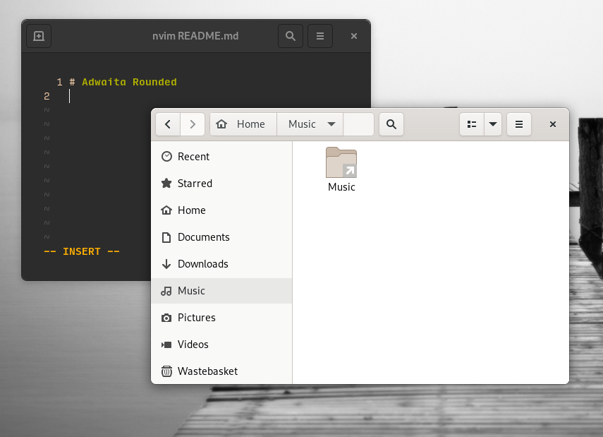

# Adwaita Rounded

Just a patch to make the bottom corners rounded. (and add some padding to the gnome-terminal too ;).



### ATTENTION

Tested only on Adwaita's light theme

### How to install

Just run the install.sh script

```
git clone https://github.com/owozsh/adwaita-rounded.git
cd adwaita-rounded
./install.sh
```
